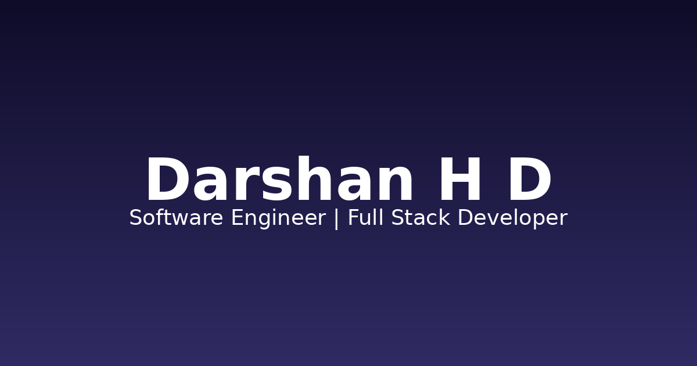

<<<<<<< HEAD
# 🚀 Darshan H D — Personal Portfolio

A modern, premium, fully responsive personal portfolio website built for a Computer Science Engineering student and Software Developer. Features a dark-themed glassmorphism aesthetic, smooth Framer Motion animations, and a production-ready Next.js 15 architecture.

**Live Demo:** [https://darshanhd.dev](https://darshanhd.dev) *(replace with your deployed URL)*



---

## ✨ Features

- 🎨 **Dark glassmorphism theme** with gradient accents and a light-mode toggle
- 🖱️ **Custom animated cursor** (desktop only)
- ✨ **Particle background** powered by tsParticles
- ⌨️ **Typing animation** in the hero section
- 📊 **Animated counters** for statistics and achievements
- 🧩 **Interactive skill cards** with animated progress bars
- 🗂️ **Project modal** with full case-study details
- 🕒 **Timeline layouts** for About and Experience sections
- 🏆 **Competitive programming profile cards** linking to LeetCode, Codeforces, CodeChef, AtCoder, GeeksforGeeks, and HackerRank
- 📬 **Functional contact form** with client + server-side validation (Server Actions)
- 🧭 **Floating glassmorphic navbar** with scroll-spy active states
- ⬆️ **Back-to-top button**
- 🌀 **Scroll-triggered animations** throughout (Framer Motion + Intersection Observer)
- 🔍 **SEO optimized**: dynamic metadata, Open Graph tags, `sitemap.xml`, `robots.txt`
- ♿ **Accessibility compliant**: semantic HTML, ARIA labels, focus states, reduced-motion support
- 📱 **Fully responsive**: mobile, tablet, and desktop breakpoints
- ⚡ **Performance optimized**: dynamic imports, font optimization, image optimization

---

## 🛠️ Tech Stack

| Category | Technology |
|---|---|
| Framework | [Next.js 15](https://nextjs.org/) (App Router) |
| Language | [TypeScript](https://www.typescriptlang.org/) |
| Styling | [Tailwind CSS](https://tailwindcss.com/) |
| Animation | [Framer Motion](https://www.framer.com/motion/) |
| Components | [Shadcn/UI](https://ui.shadcn.com/) primitives (Radix UI) |
| Icons | [Lucide Icons](https://lucide.dev/) |
| Particles | [tsParticles](https://particles.js.org/) |
| Typing Effect | react-type-animation |
| Toasts | [Sonner](https://sonner.emilkowal.ski/) |
| Theme | next-themes |

---

## 📁 Folder Structure

```
portfolio/
├── public/
│   ├── images/                  # Project screenshots
│   ├── icons/                   # Platform SVG icons
│   ├── resume.pdf               # Downloadable resume
│   ├── og-image.png             # Social share preview image
│   ├── favicon.ico
│   └── site.webmanifest
├── src/
│   ├── app/
│   │   ├── layout.tsx            # Root layout, fonts, metadata, providers
│   │   ├── page.tsx              # Main page assembling all sections
│   │   ├── globals.css           # Global styles, CSS variables, utility classes
│   │   ├── not-found.tsx         # Custom 404 page
│   │   ├── sitemap.ts            # Dynamic sitemap generator
│   │   └── robots.ts             # robots.txt generator
│   ├── components/
│   │   ├── layout/
│   │   │   ├── Navbar.tsx        # Floating responsive navbar
│   │   │   ├── Footer.tsx        # Site footer
│   │   │   └── ThemeProvider.tsx # next-themes wrapper
│   │   ├── sections/
│   │   │   ├── HeroSection.tsx
│   │   │   ├── AboutSection.tsx
│   │   │   ├── SkillsSection.tsx
│   │   │   ├── ProjectsSection.tsx
│   │   │   ├── ProjectModal.tsx
│   │   │   ├── AchievementsSection.tsx
│   │   │   ├── ExperienceSection.tsx
│   │   │   ├── CodingProfilesSection.tsx
│   │   │   └── ContactSection.tsx
│   │   └── ui/
│   │       ├── SectionWrapper.tsx   # Reusable section + title wrapper
│   │       ├── CustomCursor.tsx
│   │       ├── ParticleBackground.tsx
│   │       ├── LoadingScreen.tsx
│   │       └── BackToTop.tsx
│   ├── hooks/
│   │   ├── useScroll.ts          # Scroll position, active section, scroll progress
│   │   └── useCounter.ts         # Animated number counter
│   ├── lib/
│   │   ├── data.ts               # ALL portfolio content (single source of truth)
│   │   ├── utils.ts               # cn() class merge helper
│   │   └── actions.ts             # Server Action for contact form
│   └── types/
│       └── index.ts               # Shared TypeScript interfaces
├── tailwind.config.js
├── postcss.config.js
├── next.config.js
├── tsconfig.json
├── package.json
└── README.md
```

---

## 🚀 Getting Started

### Prerequisites

- Node.js 18.18+ (Node 20 LTS recommended)
- npm, yarn, or pnpm

### Installation

```bash
# 1. Clone or extract the project
cd portfolio

# 2. Install dependencies
npm install
# or
yarn install
# or
pnpm install

# 3. Copy environment variables
cp .env.example .env.local
# Edit .env.local and add your email service API key (see below)

# 4. Run the development server
npm run dev
```

Open [http://localhost:3000](http://localhost:3000) to view it in the browser.

### Build for Production

```bash
npm run build
npm run start
```

---

## ✏️ Customizing Your Content

**Everything is centralized in `src/lib/data.ts`.** To personalize the site, edit this single file:

- `PERSONAL_INFO` — name, headline, email, social links, resume path
- `STATS` — hero/about statistics
- `SKILLS` — categorized skill cards with proficiency levels
- `PROJECTS` — your project case studies, tags, GitHub/demo links
- `ACHIEVEMENTS` — competitive programming highlights
- `EXPERIENCE` — work, research, education timeline
- `CODING_PROFILES` — links to LeetCode, Codeforces, CodeChef, AtCoder, GeeksforGeeks, HackerRank
- `NAV_LINKS` / `SOCIAL_LINKS` — navigation and footer links

### Replacing Placeholder Assets

Add these files to the `public/` directory:

| File | Purpose | Recommended size |
|---|---|---|
| `resume.pdf` | Downloadable resume | — |
| `og-image.png` | Social share preview | 1200×630 |
| `favicon.ico`, `favicon-16x16.png`, `apple-touch-icon.png` | Browser/device icons | 16×16, 180×180 |
| `android-chrome-192x192.png`, `android-chrome-512x512.png` | PWA icons | 192×192, 512×512 |
| `images/project-*.png` | Project screenshots | 1200×800 |
| `icons/*.svg` | CP platform logos | 24×24 |

You can generate a full favicon set at [realfavicongenerator.net](https://realfavicongenerator.net/).

### Hooking Up the Contact Form

The contact form uses a Next.js **Server Action** at `src/lib/actions.ts`. By default it only logs submissions to the console. To actually send emails, integrate an email service:

**Option A — Resend (recommended):**
```bash
npm install resend
```
Uncomment the Resend integration block in `src/lib/actions.ts` and add `RESEND_API_KEY` to `.env.local`.

**Option B — Formspree / Getform / EmailJS:**
Replace the body of `submitContactForm` with a `fetch()` call to your form endpoint.

---

## 🌐 Deployment to Vercel

### Option 1: Vercel CLI

```bash
npm install -g vercel
vercel login
vercel
# Follow the prompts, then for production:
vercel --prod
```

### Option 2: GitHub + Vercel Dashboard (recommended)

1. Push this project to a GitHub repository.
2. Go to [vercel.com/new](https://vercel.com/new) and import the repository.
3. Vercel auto-detects Next.js — no configuration needed.
4. Add environment variables (e.g. `RESEND_API_KEY`) under **Project Settings → Environment Variables**.
5. Click **Deploy**.
6. (Optional) Add a custom domain under **Project Settings → Domains**.

### Environment Variables on Vercel

Add the same keys from `.env.example` in your Vercel project settings:

| Key | Required | Description |
|---|---|---|
| `RESEND_API_KEY` | Optional | Enables real email delivery from the contact form |
| `NEXT_PUBLIC_SITE_URL` | Recommended | Used for canonical URLs / Open Graph metadata |

---

## ♿ Accessibility & Performance Notes

- All interactive elements have visible focus states and ARIA labels.
- Respects `prefers-reduced-motion` to disable animations for sensitive users.
- Images use Next.js `<Image>` optimization where applicable.
- Fonts are self-hosted via `next/font` (zero layout shift, no external requests at runtime).
- Lighthouse target scores: 95+ across Performance, Accessibility, Best Practices, and SEO.

---

## 📄 License

This project is open-sourced for personal portfolio use. Feel free to fork and customize it for your own use case. Attribution appreciated but not required.

---

## 🙋 Questions?

Reach out via the [contact form](https://darshanhd.dev/#contact) or open an issue in this repository.
=======
# Darshan-portfolio
>>>>>>> 8c238cf7aeaab4a39e242b7cde5ef5913e2c23cd
